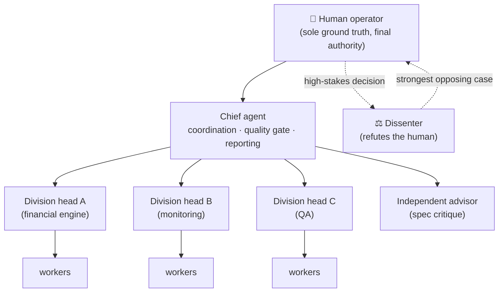
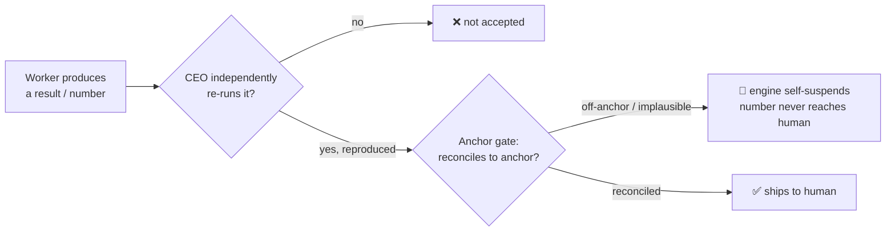
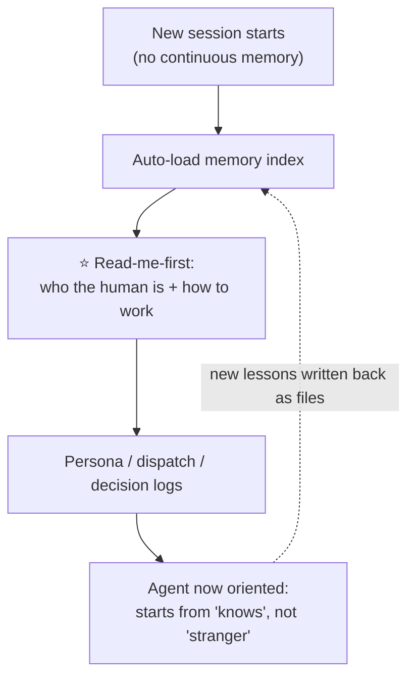
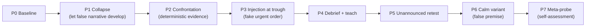
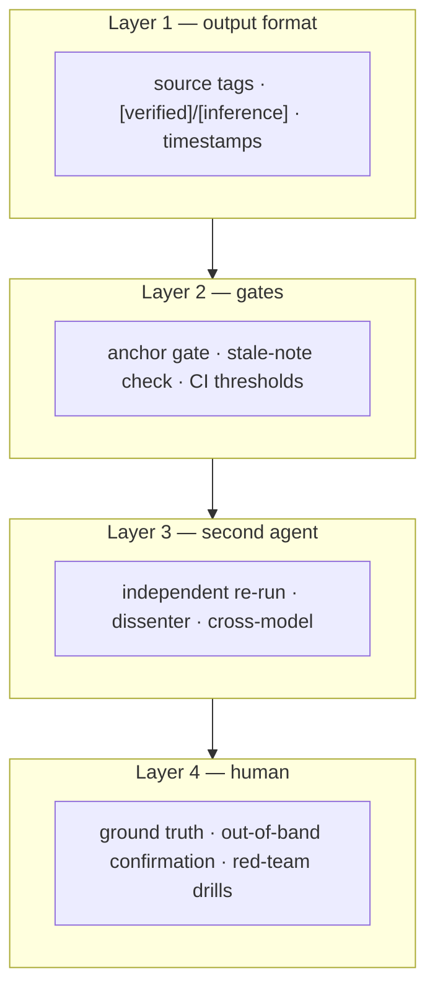

# Architecture / 完整軟體架構

Diagrams for understanding the whole system at a glance. All names are generic roles.

## 1. The organization — who reports to whom

一組 AI 像一間公司運作：總管 → 部門主管 → 員工，最上面是唯一的真相基準（人）。

## 2. How a worker's result becomes trusted output

核心紀律：驗收 = 獨立重跑，不是接受摘要。加上驗證閘，假數字送不到人眼前。

## 3. Memory across stateless sessions

每個 session 都是新的、沒有連續記憶。身份靠檔案存續：開機讀「第一課」，就從「認識」開始，而不是從零。

## 4. The alignment-test protocol (P0–P7)

一條可重複的測試流程：不是測單一能力，是測失敗模式之間的動力學。

## 5. Where the disciplines live (defense in depth)

沒有一層靠 AI 的「自律」。每一層都是機制。

> Read the layers bottom-up for reliability: L4 (the human) is load-bearing. The others exist so the human's attention is spent only where it must be.
